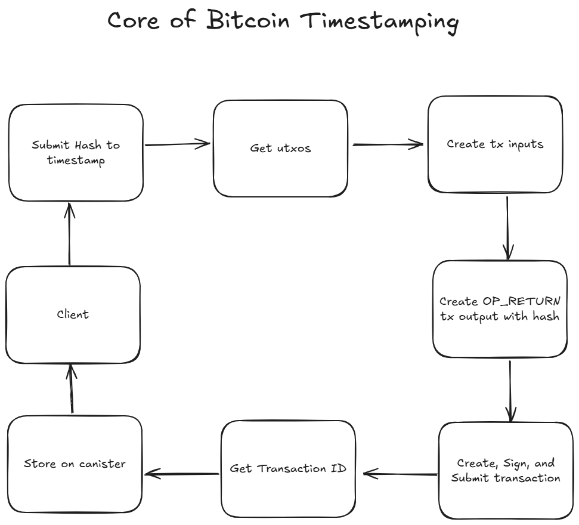

# Btstamp

Welcome to the Btstamp dApp! This innovative decentralized application harnesses the power of blockchain technology to provide secure, immutable, and transparent timestamping for digital documents. Whether you’re a legal professional, a business owner, or anyone in need of reliable document verification, our dApp is designed to meet your needs.

## Key Features

- Secure Timestamping: Leverage the unassailable security of Bitcoin’s blockchain to timestamp your documents, ensuring their integrity and authenticity.
- Immutable Records: Once a document is timestamped, the record is permanent and tamper-proof, providing peace of mind in a world where trust is crucial.
- User -Friendly Interface: Our intuitive design makes it easy for users of all technical backgrounds to navigate and utilize the dApp effectively.
- Versatile Applications: Ideal for legal documents, contracts, compliance records, and any digital asset requiring verifiable timestamps.

## How It Works



## Running the project locally

If you want to test your project locally, you can use the following commands:

```bash
# Starts the replica, running in the background
dfx start --background

# Deploys your canisters to the replica and generates your candid interface
dfx deploy
```

Once the job completes, your application will be available at `http://localhost:4943?canisterId={asset_canister_id}`.

If you have made changes to your backend canister, you can generate a new candid interface with

```bash
npm run generate
```

at any time. This is recommended before starting the frontend development server, and will be run automatically any time you run `dfx deploy`.

If you are making frontend changes, you can start a development server with

```bash
npm start
```

Which will start a server at `http://localhost:8080`, proxying API requests to the replica at port 4943.

### Note on frontend environment variables

If you are hosting frontend code somewhere without using DFX, you may need to make one of the following adjustments to ensure your project does not fetch the root key in production:

- set`DFX_NETWORK` to `ic` if you are using Webpack
- use your own preferred method to replace `process.env.DFX_NETWORK` in the autogenerated declarations
  - Setting `canisters -> {asset_canister_id} -> declarations -> env_override to a string` in `dfx.json` will replace `process.env.DFX_NETWORK` with the string in the autogenerated declarations
- Write your own `createActor` constructor

dfx deploy backend --argument '(variant { regtest })'
dfx deploy backend --argument '(variant { testnet })' --ic
